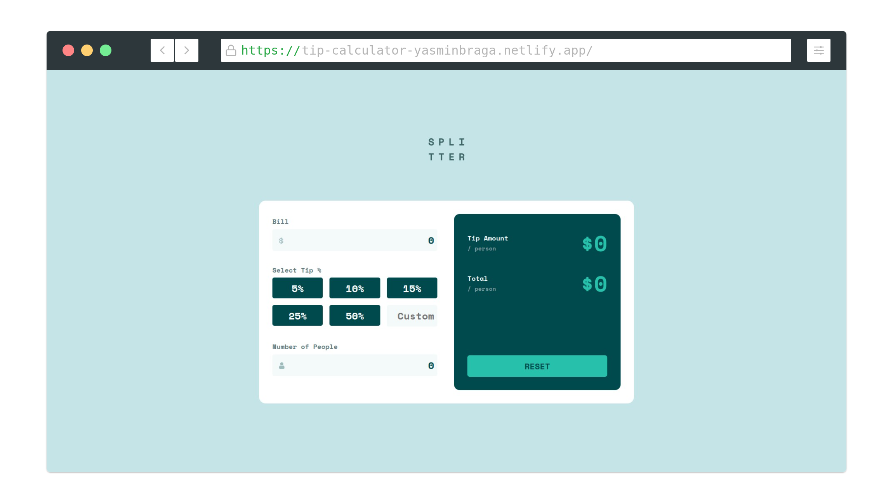

# Frontend Mentor - Tip calculator app solution

This is a solution to the [Tip calculator app challenge on Frontend Mentor](https://www.frontendmentor.io/challenges/tip-calculator-app-ugJNGbJUX). Frontend Mentor challenges help you improve your coding skills by building realistic projects.

## Table of contents

- [Overview](#overview)
  - [The challenge](#the-challenge)
  - [Screenshot](#screenshot)
  - [Links](#links)
- [My process](#my-process)
  - [Built with](#built-with)
  - [What I learned](#what-i-learned)
- [Author](#author)

**Note: Delete this note and update the table of contents based on what sections you keep.**

## Overview

### The challenge

Users should be able to:

- View the optimal layout for the app depending on their device's screen size
- See hover states for all interactive elements on the page
- Calculate the correct tip and total cost of the bill per person

### Screenshot



### Links

- Solution URL: [Github solution](https://github.com/yasminbraga/tip-calculator)

- Live Site URL: [Tip Calculator](https://tip-calculator-yasminbraga.netlify.app/)

## My process

### Built with

- Semantic HTML5 markup
- CSS custom properties with the help of Scss
- Flexbox
- CSS Grid
- Mobile-first workflow
- [React](https://reactjs.org/) - JS library

### What I learned

For this project I used ReactJs library to create all the interface an practice the principal concepts around the library.

- Class components for the main application

```js
class TipCalculator extends React.Component {
  render() {
    return <main className={styles.container}>application</main>;
  }
}
```

- Function components for the components

```js
export default funcion Input(props) {
  return (
    <div>
      <label>input type</label>
      <input type="text" />
    </div>
  )
}
```

- State and Handling Events

```js
this.state = {
  bill: 0
}

handleSetBill(e) {
  this.setState({ bill: e.target.value })
}
```

## Author

- Frontend Mentor - [@yourusername](https://www.frontendmentor.io/profile/yasminbraga)
- Instagram - [@yasminbragat](https://www.instagram.com/yasminbragat/)
